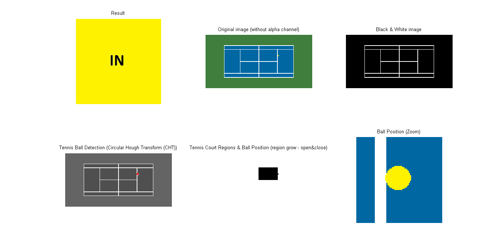
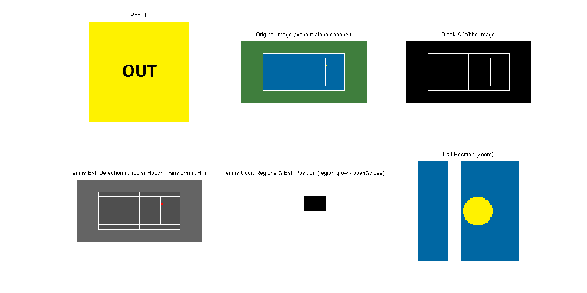

# hawk-eye-sim

Small toy app using Matlab to test some image processing operations simulating a Tennis Hawk Eye.

The script received as input a simplified image of a tennis court with a tennis ball over the court (or None) and some additional data (like the the of game Single or Doubles). 

Using different image operations and techniques (i.e erosion, dilation, region growing, etc.) the script returna as output if the ball is IN or OUT the valid area of the tennis court.

## Screenshots

## Requirements

To run this application a version of [Matlab](https://la.mathworks.com/products/matlab.html) is needed.

## Run the examples

* [imhawkeye.m](imhawkeye.m): implements the algorithm
* [imhawkeye_test.m](imhawkeye_test.m): run a buch of test using different input images
